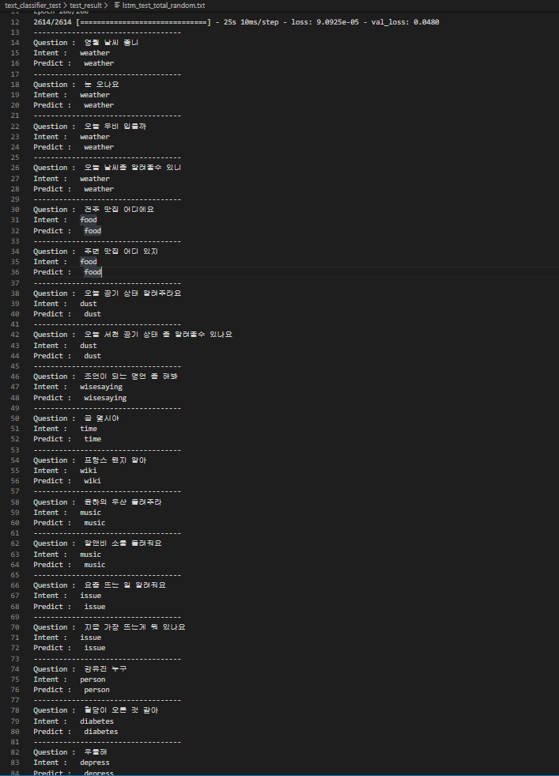
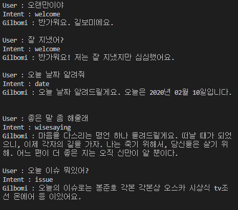

# chatbot_test
길보미를 만들기 위한 모든 테스트를 담습니다.

 

chatbot_test
  - intent_classifier_test
  - sentiment_test
  - entity_recog_test
  - app

 
 
디렉토리명 | 내용 | 사용한 패키지
---|:---:|---:
`intent_classifier_test` | **Intent분류**를 위한 LSTM모델 생성 | `keras, sklearn`
`sentiment_test` | 우울증 확인을 위한 **감성분석** 부분 | `Konlpy, gensim`
`entity_recog_test` | **Entity인식**을 위한 CNN,BiLSTM모델 생성 | `Keras, sklearn`
`app` | **통합애플리케이션** | `통합 멀티 모듈`

 

## intent_classifier_test
Seq2Seq 방식 (Encoder RNN, Decoder RNN의 조합) 사용
 
- rnn_test.py : 바닐라RNN로 인텐트 분류, 성능이 좋지 않다..
- lstm_test_total_random.py : 여러 성능테스트(하이퍼파라미터튜닝 : 데이터셋 랜덤, 스케일 등등)
  - lstm_test.py : grrc데이터 외의 question-intent데이터(train_intent.csv)만 훈련
  - lstm_test2.py : grrc데이터(intent_grrc.csv)만 훈련
  - lstem_test_total.py : 두가지 데이터를 합쳐서 훈련
- lstm_save_v1.py : LSTM으로 인텐트 분류, 성능이 매우 좋지 않음
- cnn1d_v2.py : CNN1D레이어를 이용하여 인텐트 분류, 성능 acc : 0.9671, loss에 비해 val_loss가 떨어진다. (현재 적용 중인 모델)
- load_model.py : 저장된 모델 불러와서 테스트하는 모델
- seq2seq_backup.py : seq2seq모델을 이용한 인텐트 분류. acc 1로 매우 좋지만 restore과정에 문제가 있다. 
  https://github.com/keras-team/keras/issues/4875 참고
 
데이터셋 늘려서 train, test, validation으로 나누기
정규화 필요
intent recog, entity recog 합칠 때 앙상블 모델 사용?
  

- 결과
  - intent classifier

 
  - app module

  
## sentiment_test
진행 중

## entity_recog_test
- Data
  - Exobrain 객체검출 학습데이터 API신청 후 이용하기 -> '/data/exo_data.csv' (완료)
  - 국립국어원 언어정보나눔터 '개체명 인식용 말뭉치' -> '/data/raw_data.json'
